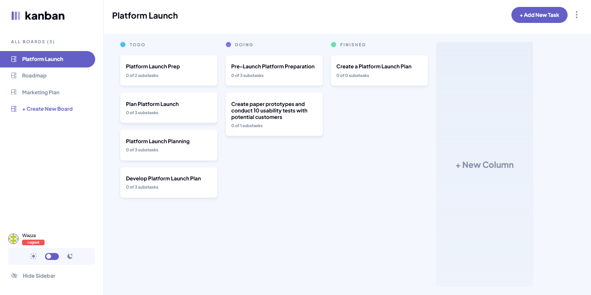
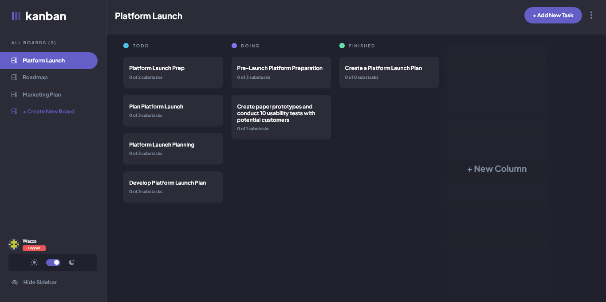

# Kanban task management web app

Introducing the ultimate Kanban management app, designed to help you visualize and organize your workflow with ease! Our app is a comprehensive solution for teams and individuals who want to streamline their work processes and increase productivity. With a user-friendly interface and intuitive features, our app makes it easy to create boards, add tasks, and move items through the stages of your workflow.

## Table of contents

- [Overview](#overview)
  - [The challenge](#the-challenge)
  - [Screenshot](#screenshot)
  - [Links](#links)
- [My process](#my-process)
  - [Built with](#built-with)
  - [What I learned](#what-i-learned)
  - [Continued development](#continued-development)
  - [Useful resources](#useful-resources)
- [Author](#author)

## Overview

### The challenge

Users should be able to:

- View the optimal layout for the app depending on their device's screen size
- See hover states for all interactive elements on the page
- Create, read, update, and delete boards and tasks
- Receive form validations when trying to create/edit boards and tasks
- Mark subtasks as complete and move tasks between columns
- Hide/show the board sidebar
- Toggle the theme between light/dark modes
- **Bonus**: Allow users to drag and drop tasks to change their status and re-order them in a column
- **Bonus**: Keep track of any changes, even after refreshing the browser (`localStorage` could be used for this if you're not building out a full-stack app)
- **Bonus**: Build this project as a full-stack application

### Screenshot

### Links

- Solution URL: [Add solution URL here](https://your-solution-url.com)
- Live Site URL: [https://kanaban-management.vercel.app/](https://kanaban-management.vercel.app/)

## My process

### Built with

- [Next.js](https://nextjs.org/)
- [CSS Modules](https://github.com/css-modules/css-modules) - For styles
- [NextAuth](https://next-auth.js.org/) - Handling authentication
- [Prisma](https://www.prisma.io/) - ORM
- [Postgresql](https://www.postgresql.org/) - Database

### What I learned

An interesting project all together, this was my first time using Prisma orm and also postgresql, I definitely learn a lot about sql databases and how the function. This was also my first time trying the app directory in the latest Nextjs13, other than the aforementioned technologies I guess I'll also add the use of Reacts drag and drop API was quite interesting, not to forget I also used Open AI's text generation too to automate a little feature in this project.

### Continued development

In the future I hope to continue learning and working a lot with sql databases.

### Useful resources

- [NextJs 13 docs](https://beta.nextjs.org/docs) - This helped me a lot when working with NextJs new app dir.

## Author

- Website - [Leonard Ikeh](https://leonardikeh.netlify.app/)
- Frontend Mentor - [@leoikeh99](https://www.frontendmentor.io/profile/leoikeh99)
- Twitter - [@wazza_dev](https://www.twitter.com/wazza_dev)
